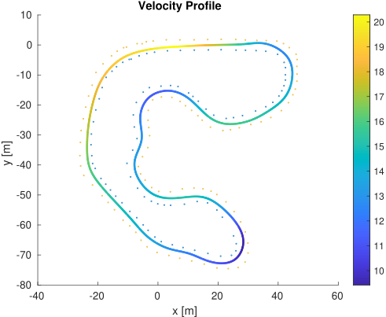

# Trajectory Optimizer  

    
Table of Contents

    <ol>
        <li>
        <a href="#disclaimer">Disclaimer</a>
        </li>
        <li><a href="#dependencies">Dependencies</a>
        </li>
        <li>
        <a href="#approach">Approach</a>
        </li>
        <li>
        <a href="#workflow">Workflow</a>
        </li>
        <li>
        <a href="#parameters">Parameters</a>
        </li>
    </ol>

Formula Student model-based trajectory optimization algorithm. This algorithm is shared as part of my [Final Degree Thesis](https://hdl.handle.net/2117/405362). Developed during the 2021-22 Formula Student season, it's an offline trajectory optimization approach relying on a dynamic bicycle model which is avaluated for the whole midline path in order to find the optimal path. This approach can be seen as a one-time MPC execution with an horizon lenght (or prediction horizon) as long as the given midline.

## Disclaimer
This is a tailored motion planning solution developed for CAT14X & CAT15X [BCN eMotorsport](https://bcnemotorsport.upc.edu) cars. If you plan to use this algorithm in any Formula Student Competition the **only** thing I ask for is to **ALWAYS REFERENCE** the team ___BCN eMotorsport___.

## Dependencies
* [Ubuntu](https://ubuntu.com/) 20.04
* [ROS](https://www.ros.org/) Noetic
* [CasADi](https://web.casadi.org/) using [Ipopt](https://coin-or.github.io/Ipopt/) solver
* [Eigen3](https://eigen.tuxfamily.org)
* ___as_msgs___: self-defined ROS msgs pkg. You may change it for yours, adapting the [necessary functions](include/TRO.hh)

___NOTE:___ CasADi should be built from sources in your _/home_ directory, where this pkg will look for it. If you have installed CasADi somewhere else adapt the [CMakeLists.txt](CMakeLists.txt) before building this pkg. 

_In order to install casadi from source, follow [this tutorial](https://github.com/casadi/casadi/wiki/InstallationLinux)_.

When building CasADi from source the Ipopt solver is already included so the Building CasADi from sources section is the only one to follow from the tutorial mentioned above.

## Approach
For specific information on how the trajectory optimization procedure is done please read [this thesis](https://hdl.handle.net/2117/405362).

The most important advantage of this optimization algorithm is that it is not based on any geometrical approach, but it tries to find the optimal race line by taking into account the constraints imposed by the dynamic bicycle model. This way, apart from the actual race line, an optimal state for each point of the trajectory is obtained. This means that it also outputs **vx**, **vy** and **yawrate** profiles as well as **steering** and **throttle** commands profiles. 

FSG2019 track results:

  
  

For more results [read this](https://hdl.handle.net/2117/405362).

## Workflow
This pkg includes three different nodes (or executables), which are thought to be run in the following order: 
* `midline` _(offline)_ executable is meant to be executed through [midline.launch](launch/midline.launch). It reads the detected cones during a complete run and saves the midline trajectory.
* `optimizer` _(offline)_ executable is meant to be executed through [optimizer.launch](launch/optimizer.launch). It reads the midline trajectory, sets up the Optimization Problem and solves it. It saves the results in [x_opt](data/x_opt.csv) file.
* `tro` _(online)_ executable is meant to be executed through [tro.launch](launch/tro.launch). It's the only node thought to run _online_. It reads the Optimization Problem solution and computes the optimal trajectory, as well as interpolating the optimal states, before publishing the partial trajectory data to the ROS network.

## Parameters
_Explanation of all the parameters used:_
| Parameter        | Summary                               | Value [SI]  |
| ---------------- | ------------------------------------- | ----------- |
| Qs         | Progress rate weight                  | 1.0         |
| Qslip      | Slip difference weight                | 0.1         |
| Rd         | Steering rate weight                  | 1.4         |
| Ra         | Acceleration rate weight              | 0.3         |
| RMtv       | Additional moment weight              | 1.0         |
| Bf         | Pacejka Constant                      | 10.5507     |
| Br         | Pacejka Constant                      | 10.5507     |
| Cf         | Pacejka Constant                      | -1.2705     |
| Cr         | Pacejka Constant                      | -1.2705     |
| Df         | Pacejka Constant                      | 2208.0635   |
| Dr         | Pacejka Constant                      | 2563.599    |
| Lf         | Distance from CoG to front axis       | 0.708       |
| Lr         | Distance from CoG to rear axis        | 0.822       |
| L                     | Total car's length                    | 2.72        |
| W                     | Total car's width                     | 1.5         |
| m                     | Car's mass                            | 210.0       |
| Iz         | Inertial moment around z axis         | 180.0       |
| rhoair     | Air's density                         | 1.255       |
| Aaero      | Drag area                             | 1.0         |
| Cd         | Drag coefficient                      | 1.2727      |
| Cmotor     | Motor Constant (max. N)               | 4283.4645   |
| Cr         | Rolling resistance (\% of car's weight) | 0.45\%      |

